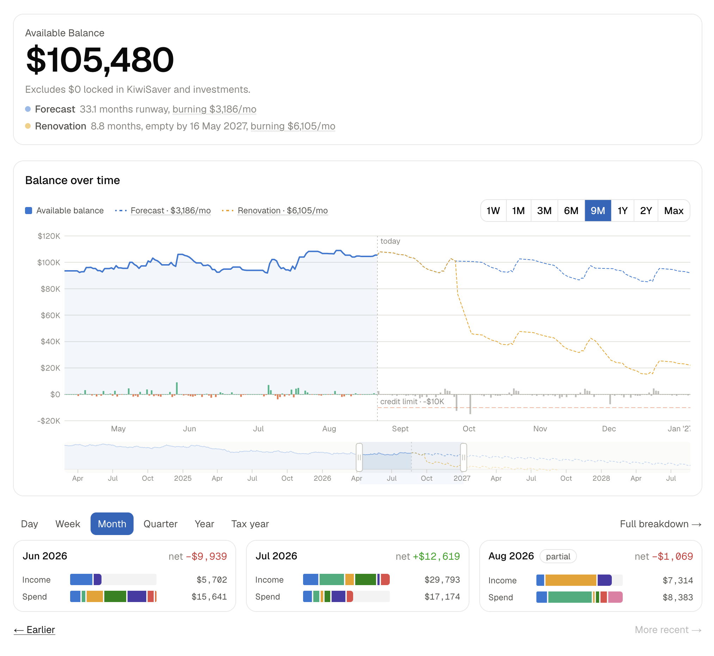
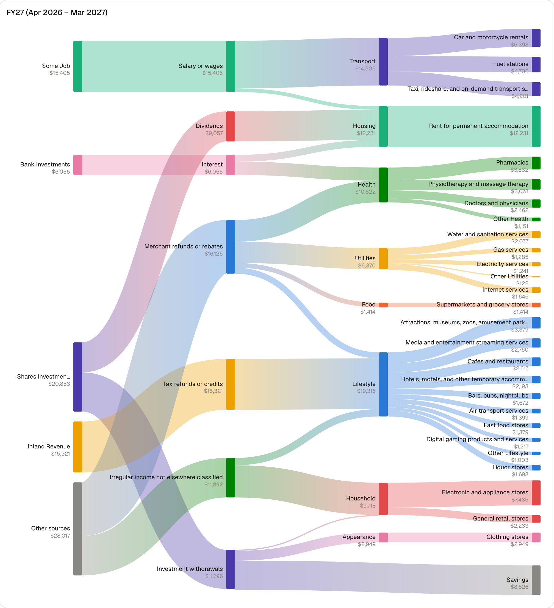
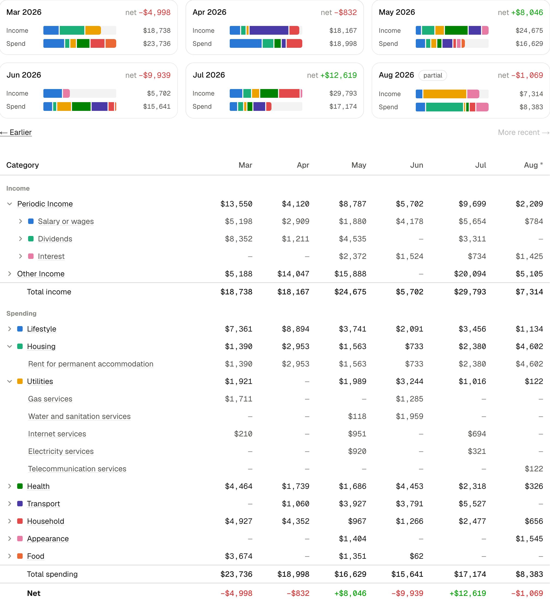

# Money

A self-hosted personal finance dashboard for New Zealand bank accounts. It mirrors your accounts from [Akahu](https://akahu.nz) into your own Postgres, then gives you fast, offline views of balance, spending, income and every transaction.

Your data stays on your machine. Nothing is sent to a third party, including the AI features — the model runs locally.



## Why use it

- **You own the data.** Local Postgres, local model, no SaaS account, no analytics.
- **Reads never hit the bank.** Pages load from your database; syncing is a background job.
- **Built for NZ.** [NZFCC](https://nzfcc.org) categories, `Pacific/Auckland` period bucketing, tax-year views.
- **Forecasting, not just history.** Budgets project forward and draw a runway line: how many months you have left at your current burn.
- **Household-shareable.** Workspaces with owner/editor/viewer roles, isolated by Postgres Row-Level Security.

## What you get

**Money flow** — where income came from and where it went, for any period.



**Breakdowns** — compare periods side by side, drill down to category, subcategory and merchant.



Plus:

| | |
| --- | --- |
| **Transactions** | Search, bulk-categorise, link transfers, tag, per-transaction change history. |
| **Budgets** | Recurring plans with seasonal layers, budget-vs-actual, forward forecasts. |
| **Rules** | Auto-categorise on every sync. Taught from one classified transaction. |
| **Chat** | Ask a local LLM about your money; it can write budgets, categories and rules with permission. |
| **Accounts & sync** | Balances, running histories, and an audit log of every ingest run. |

## Setup

Needs Node `^20.19 || ^22.12 || >=24.0`, `pnpm`, and Docker or Podman.

```bash
# 1. Install
pnpm install

# 2. Configure
cp .env.example .env
```

Set these five in `.env`:

| Variable | Where from |
| --- | --- |
| `BETTER_AUTH_SECRET` | `openssl rand -base64 32` |
| `APP_DB_PASSWORD` | Any value you pick |
| `SYNC_DB_PASSWORD` | Any value you pick |
| `AKAHU_APP_ID_TOKEN` | [my.akahu.nz](https://my.akahu.nz) |
| `AKAHU_USER_ACCESS_TOKEN` | [my.akahu.nz](https://my.akahu.nz) |

`DATABASE_URL` already points at the local Postgres from step 3.

```bash
# 3. Start Postgres
pnpm db:up

# 4. Create the schema and the RLS role passwords
pnpm db:setup

# 5. Create the first user and workspace
#    Sign-up is invite-only, so the first account can't come from the app.
./bin/money user create --email you@example.com --name "Sam"
./bin/money workspace create --owner you@example.com --name "Personal"

# 6. Pull your data from Akahu
./bin/money sync --drain

# 7. Run it
pnpm dev
```

Open <http://localhost:3000> and sign in.

**Two gotchas:**

1. Nothing syncs unless something is draining the queue — keep `pnpm worker:start` running, or pass `--drain` to `money sync`.
2. Chat and AI budget inference need `LLM_API` pointed at a local OpenAI-compatible endpoint (Ollama, typically). Without it, budgets fall back to a deterministic seeder and `/chat` reports no model.

Everyone after the first user joins via an invite link from `/w/<slug>/members`.

## Development

| Command | Does |
| --- | --- |
| `pnpm dev` | Dev server on :3000. |
| `pnpm worker:start` | Drain sync + budget-inference queues (run alongside `dev`). |
| `pnpm test` | `tests/*.test.ts` — needs a running database. |
| `pnpm lint` / `pnpm typecheck` | ESLint / `tsc --noEmit`. |
| `pnpm build` / `pnpm start` | Production build and serve. |

### Database

| Command | Does |
| --- | --- |
| `pnpm db:up` / `pnpm db:down` | Start/stop local Postgres. |
| `pnpm db:migrate` | Create and apply a migration (dev). |
| `pnpm db:setup` | Apply migrations + set RLS role passwords. |
| `pnpm db:studio` | Prisma Studio. |
| `pnpm db:seed-demo` | Fill a workspace with fake transactions. |

### The `money` CLI

`pnpm` scripts act on the checkout. `./bin/money` acts on a **running instance** — things the app deliberately can't do: mint the first account, create a tenant, store a bank token, reset a password for someone with no session.

```bash
./bin/money --help              # every command, grouped
./bin/money sync --watch        # queue a sync and follow it
./bin/money user list           # accounts, roles, MFA status
./bin/money workspace list      # workspaces, members, bank links
```

Every command answers `--help` with no database and no env configured.

### Layout

```
app/w/[workspace]/   Tenant-scoped pages. /login, /invite, /account are not.
lib/server/          Queries, ingest, rules, budget, chat, metrics, RLS-scoped db
lib/                 Shared logic: categories, periods, sankey, formatting
ui/                  React components   ·   components/ui/  shadcn primitives
cli/                 The money CLI      ·   scripts/  worker and db processes
prisma/              Schema and migrations
proxy.ts             Session gate, workspace routing, CSP
```

## Deployment

Two supported shapes, both containerised with Postgres published nowhere:

- **Compose** — `docker compose -f compose.prod.yaml up -d --build`
- **Rootless Podman Quadlet** — [deploy/quadlet/](deploy/quadlet/), see [its README](deploy/quadlet/README.md).

Both run five services (postgres, migrate, app, worker, cron) and split the database identity three ways: the schema owner migrates, the app connects as `money_app`, the worker and cron as `money_sync`. Only the worker holds the key that opens a stored Akahu token.

## Design notes

- **Offline reads.** No page load calls Akahu. Ever.
- **Row-Level Security.** Every query goes through `scopedDb(workspaceId)`; Postgres policies do the filtering, and [tests/isolation.test.ts](tests/isolation.test.ts) proves it holds.
- **Your edits win.** A category you set is marked `source: "user"` and later syncs won't overwrite it. If Akahu disagrees, you get a conflict to reconcile.
- **Exact money.** Stored as `numeric(19, 4)`, converted to numbers at the read boundary.
- **Local-only AI.** `LLM_API` is checked for a loopback or private address before anything is sent. A public one is refused unless `LLM_ALLOW_REMOTE=true`.

Full annotated environment variables: [.env.example](.env.example).

Built with Next.js 16, React 19, TypeScript, Tailwind 4, Prisma 7, Postgres.

## License

MIT
